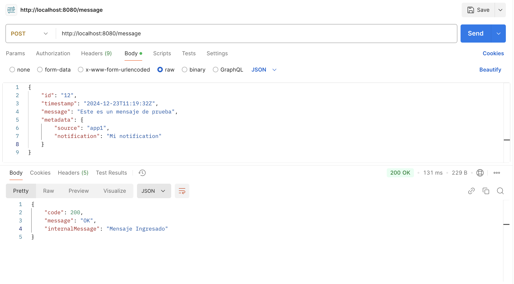
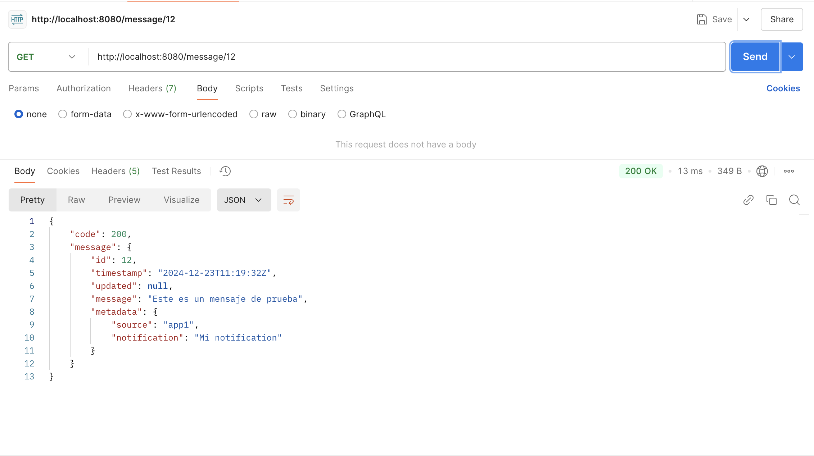
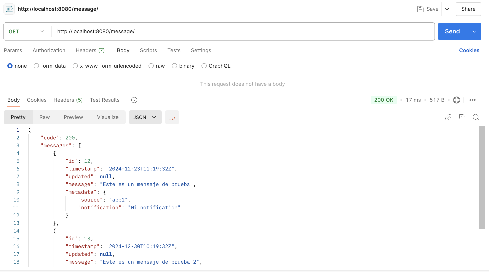

# Prueba Banco Central

Prueba técnica de Banco Central. Microservicio y comunicacion con Kafka.


## 1. Instalación

Clonar en directorio local
```
git clone https://github.com/njcortes/prueba-bcentral.git
```


### 1.1. Instalación Kafka en docker
Ir al directorio donde esta alojado el yaml
```
cd kafka
```
Luego ejecutar
```
docker compose up -d
```

### 1.2. Ejecución Microservicio
En la raiz del proyecto ejecutar
```
java -jar message/target/message-0.0.1-SNAPSHOT.jar
```

## 2. Pruebas

Considerar la siguiente URL:
```
http://localhost:8080/message
```

### 2.1 Metodo POST

```
{
    "id": "12",
    "timestamp": "2024-12-23T11:19:32Z",
    "message": "Este es un mensaje de prueba",
    "metadata": {
        "source": "app1",
        "notification": "Mi notification"
    }
}
```
<p></>

### 2.1 Metodo GET
Método para obtener un registro mediante parametro (ID) en URL
<p></>

Método para obtener todos los registros
<p></>
